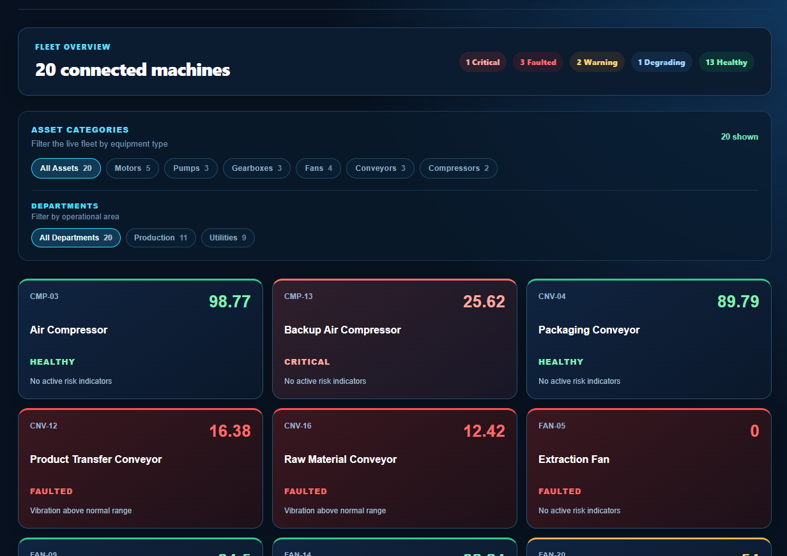
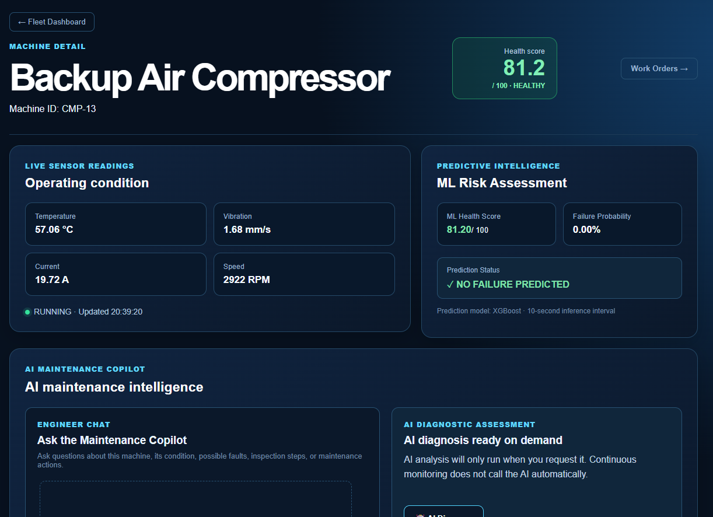
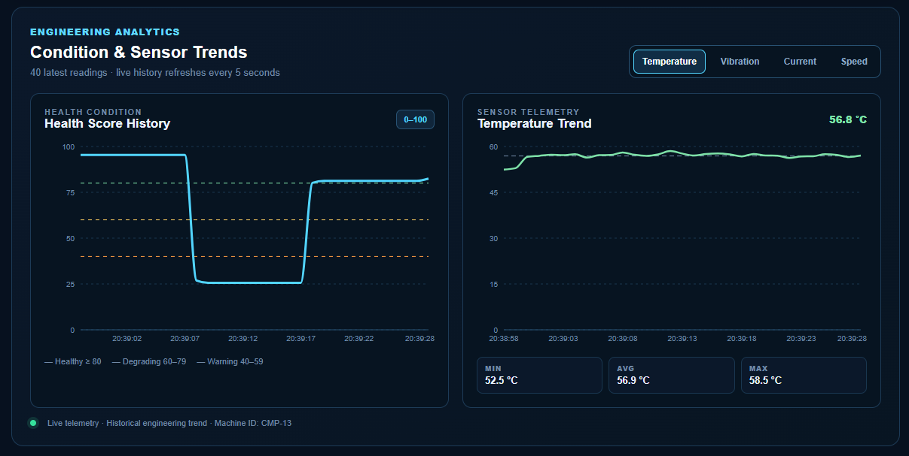
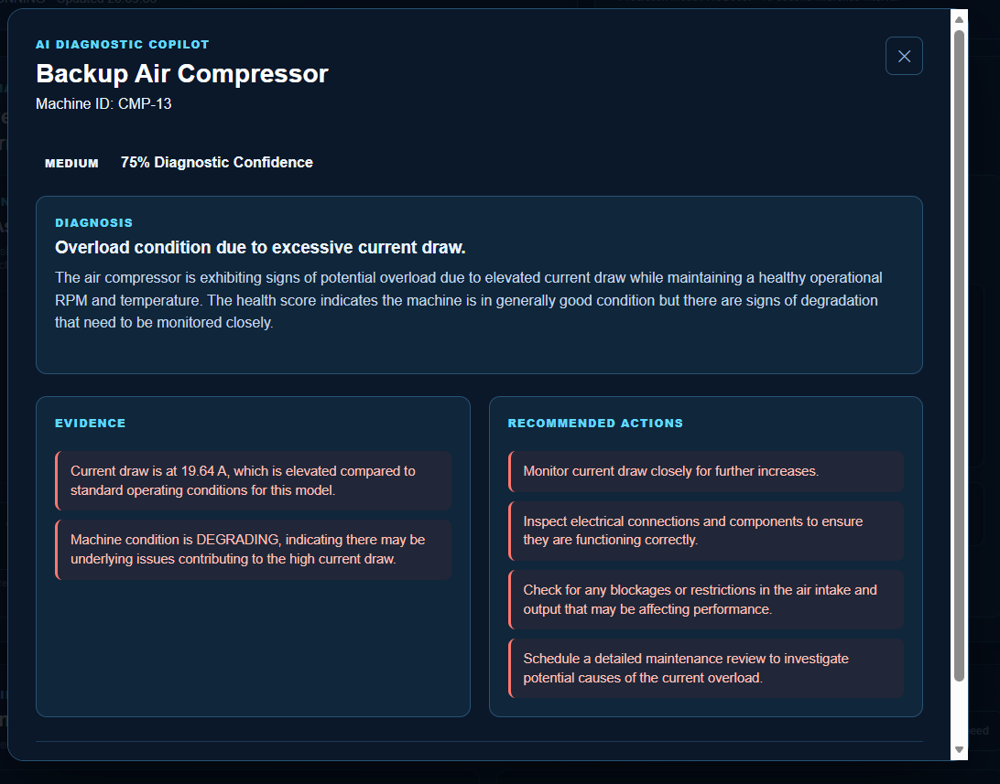
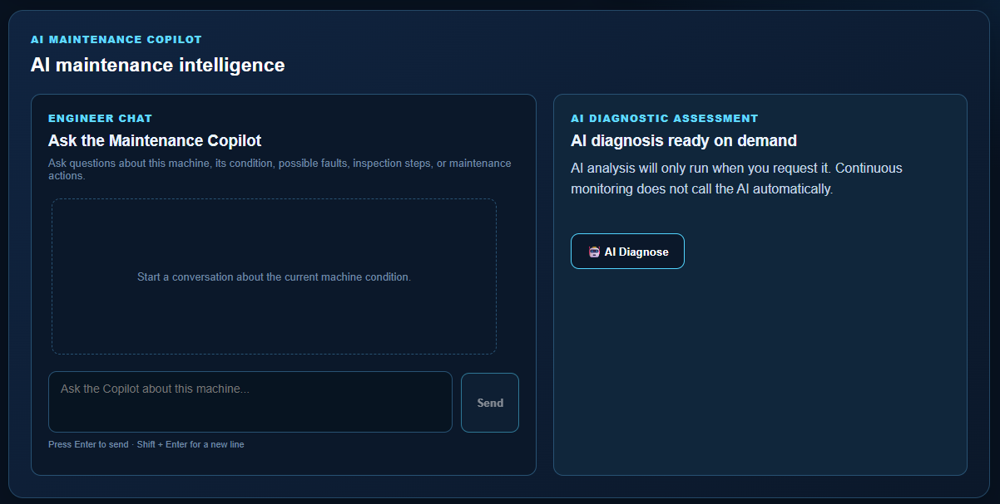
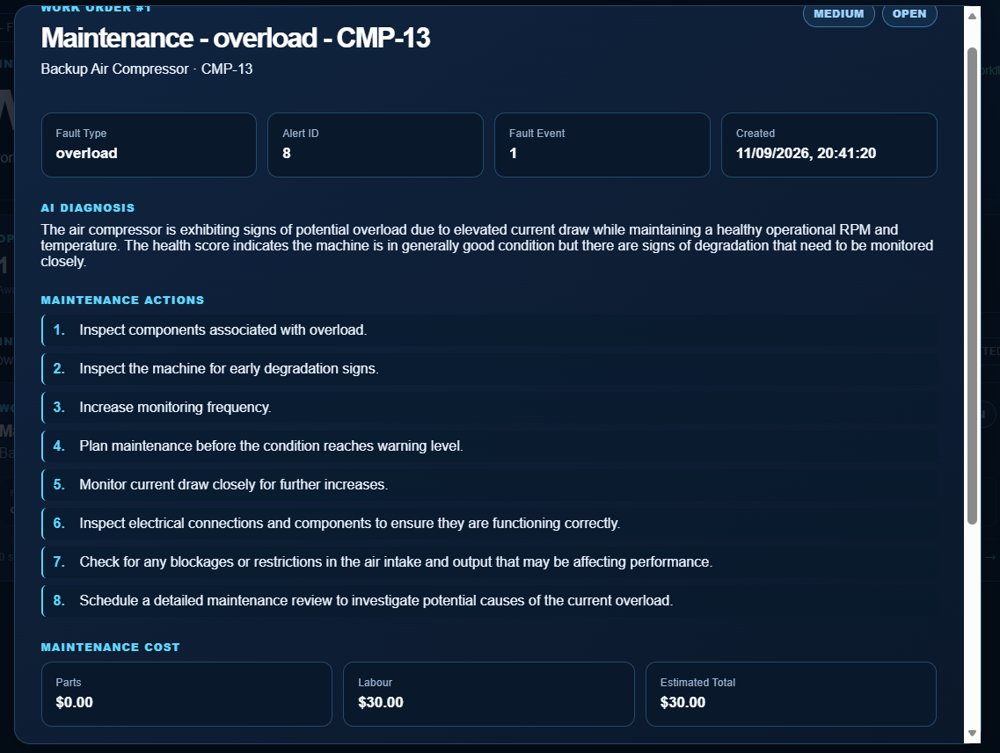

# ⚙️ ProDiag AI V2

### Agentic Predictive Maintenance Copilot for Industrial Assets

> **From Machine Signals to Maintenance Decisions.**

**Predict Before Failure. Act Before Downtime.**

[🌐 Live Demo](https://prodiagai.vercel.app) · [💻 GitHub](https://github.com/NipunKavinda95/ProDiagAI_v2)

---

## 🎯 Overview

ProDiag AI V2 is an AI-powered industrial predictive-maintenance platform combining Industrial IoT, Machine Learning, Anomaly Detection, RAG and AI-powered maintenance intelligence.

The platform helps engineers **monitor machine health, identify potential failures, investigate faults and plan maintenance actions**.

> **Core Principle:** AI should help engineers make better maintenance decisions — not replace engineering responsibility.

---

## 🏭 Business Problem

Industrial operations depend on critical assets such as motors, pumps, compressors, conveyors, gearboxes and fans.

Unexpected equipment failure can cause:

- Production interruption
- Unplanned downtime
- Emergency maintenance
- Higher maintenance pressure
- Delayed production
- Reduced equipment availability
- Increased operational cost

### The challenge

**How can maintenance teams identify warning signs early enough to act before a failure becomes a major operational problem?**

---

## 💡 The Solution

ProDiag AI moves maintenance from:

**Reactive Maintenance**

`Machine fails → Emergency response → Repair → Production impact`

toward:

**Predictive / AI-Assisted Maintenance**

`Machine Data → Health → Risk → Diagnosis → Recommendation → Engineer Decision → Maintenance Action`

---

## 🔄 Product Workflow

```text
🏭 Machine Sensors / PLC
          ↓
📡 Industrial Telemetry
          ↓
❤️ Machine Health
          ↓
🧠 ML Prediction
          ↓
🚨 Anomaly & Fault Detection
          ↓
🔔 Alerts
          ↓
🤖 AI Diagnosis
          ↓
💬 Engineer Copilot
          ↓
🔧 Maintenance Recommendation
          ↓
👨‍🔧 Engineer Approval
          ↓
📝 Work Order
```

---

## ✨ Core Capabilities

| Capability             | Purpose                                     |
| ---------------------- | ------------------------------------------- |
| 📡 Industrial IoT      | Real-time MQTT machine telemetry            |
| 🏭 Fleet Monitoring    | Monitor a 20-machine demonstration fleet    |
| ❤️ Health Intelligence | Continuous 0–100 machine health scoring     |
| 🧠 ML Prediction       | Failure probability and health prediction   |
| 🚨 Anomaly Detection   | Isolation Forest + engineering rules        |
| 🔔 Intelligent Alerts  | Machine condition and risk alerts           |
| 📚 RAG Knowledge       | Engineering maintenance knowledge retrieval |
| 🤖 AI Diagnosis        | Evidence-based potential fault diagnosis    |
| 💬 Engineer Copilot    | Conversational maintenance assistance       |
| 📝 Work Orders         | Engineer-approved maintenance execution     |
| 🛡️ Guardrails          | Input, output, API and AI safety controls   |
| 🤖 Agentic Roadmap     | Planning, parts, cost, PM and scheduling    |

---

## 📸 Product Screenshots

Create a folder:

```text
docs/screenshots/
```

and add these screenshots:

### Fleet Dashboard

```markdown

```

Shows the 20-machine fleet, health distribution and equipment categories.

### Machine Detail

```markdown

```

Shows individual machine health, prediction and maintenance intelligence.

### Analytics

```markdown

```

Shows sensor trends, machine condition patterns and predictive health insights.

### AI Diagnosis

```markdow

```

Shows AI-assisted fault analysis, evidence and recommended maintenance actions.

Shows warnings, critical events and machine-condition changes.

### Engineer Copilot

```markdown

```

Shows AI-assisted maintenance investigation.

### Work Orders

```markdown

```

Shows engineer-approved maintenance actions.

> **Tip:** Use the real screenshots from the deployed Vercel application. This makes the GitHub page look like a professional product showcase rather than a code repository.

---

## 🧠 Machine Health Intelligence

|     Score | Condition |
| --------: | --------- |
| 🟢 80–100 | Healthy   |
|  🔵 60–79 | Degrading |
|  🟡 40–59 | Warning   |
|  🟠 20–39 | Critical  |
|   🔴 0–19 | Fault     |

Machine lifecycle:

`HEALTHY → DEGRADING → WARNING → CRITICAL → FAULTED`

Recovery:

`FAULTED → REPAIRING → RESTART → HEALTHY`

---

## 🔍 Predictive & Anomaly Intelligence

### Machine Learning

**XGBoost** is the selected failure-prediction model.

Evaluation includes:

- F1-score
- Precision
- Recall
- Confusion matrix
- Classification threshold analysis

### Anomaly Detection

```text
Live Telemetry
      ↓
Feature Processing
      ↓
 ┌───────────────┐
 │               │
 ▼               ▼
Isolation      Engineering
Forest            Rules
 │               │
 └───────┬───────┘
         ↓
Combined Anomaly Result
         ↓
Alert / Maintenance Intelligence
```

---

## 📚 RAG Engineering Knowledge

ProDiag AI grounds maintenance assistance in engineering knowledge.

Knowledge sources include:

- Maintenance manuals
- Fault codes
- Bearing failure modes
- Maintenance SOPs
- Spare parts
- Industry standards
- Historical faults

```text
Engineering Documents
        ↓
Preprocessing
        ↓
Section-Aware Chunking
        ↓
OpenAI Embeddings
        ↓
Pinecone
        ↓
Relevant Engineering Knowledge
        ↓
AI Maintenance Copilot
```

Retrieved documents are treated as **reference evidence**, not AI instructions.

---

## 🤖 AI Maintenance Intelligence

### AI Diagnosis

Provides:

- Probable fault
- Diagnosis
- Confidence
- Evidence
- Recommended actions
- Urgency
- Escalation recommendation

### Engineer Copilot

Combines:

`Machine Context + ML Prediction + Anomaly Evidence + RAG Knowledge + Conversation Context`

into an AI-assisted maintenance recommendation.

---

## 🧑‍🔧 Human-in-the-Loop

ProDiag AI is a **decision-support system**, not an autonomous machine-control system.

```text
Machine Risk
     ↓
AI Diagnosis
     ↓
Maintenance Recommendation
     ↓
Engineer Review
     ↓
Engineer Decision
     ↓
Work Order / Maintenance Action
```

The AI recommends. **The engineer decides.**

---

## 🛡️ AI Safety & Security

Implemented controls include:

**Input**

- Question validation
- Length limits
- Conversation-history limits
- Message validation
- Control-character sanitisation
- Prompt-injection detection

**API**

- CORS restrictions
- Payload limits
- Rate limiting
- Global error handling
- Safe API error messages

**AI Output**

- Structured response validation
- Required-field validation
- Data-type validation
- Response-length limits
- Evidence validation
- Recommendation validation
- Source validation

**RAG**

- Retrieved engineering documents are treated as untrusted reference data and cannot override system instructions.

---

## 🏗️ Architecture

```text
Industrial Sensors / PLC / Simulator
              │
              ▼
        MQTT / IIoT
              │
              ▼
       ProDiag Flask API
              │
     ┌────────┼─────────┐
     ▼        ▼         ▼
    ML     Anomaly     Alerts
     │        │         │
     └────────┼─────────┘
              ▼
       AI Diagnosis
              │
       RAG + OpenAI
              │
              ▼
      Engineer Copilot
              │
              ▼
      Engineer Approval
              │
              ▼
         Work Order
```

---

## ☁️ Deployment

Current web deployment:

```text
User
 ↓
Vercel
React + Vite
 ↓ HTTPS API
Render
Flask Backend
 ↓
OpenAI / Pinecone / Database
```

Industrial telemetry is demonstrated through a PLC/sensor simulator connected through MQTT.

### 🔗 Links

- **Live Product:** https://prodiagai.vercel.app
- **GitHub:** https://github.com/NipunKavinda95/ProDiagAI_v2

---

## 🧰 Technology Stack

**Frontend:** React · TypeScript · Vite · Tailwind CSS · Recharts

**Backend:** Python · Flask · Flask-CORS · Flask-Limiter · SQLAlchemy

**Industrial IoT:** MQTT · Paho MQTT · Mosquitto

**Machine Learning:** NumPy · Pandas · scikit-learn · XGBoost · Joblib

**AI / RAG:** OpenAI · LlamaIndex · Pinecone

**Scheduling:** APScheduler

**Testing:** pytest

**Deployment:** Vercel · Render

---

## 🏭 Demonstration Environment

The current demonstration contains **20 simulated industrial machines** with independent conditions and progressive fault behaviour.

Supported simulated conditions include:

- Healthy
- Degrading
- Warning
- Critical
- Faulted
- Repairing
- Restart

Simulated fault types:

- Bearing wear
- Cavitation
- Overload
- Belt misalignment
- Fan imbalance
- Gear wear

In a real-world deployment, the simulator can be replaced by **physical PLCs, sensors or industrial edge gateways**.

---

## 📊 Project Status

| Component                 |   Status   |
| ------------------------- | :--------: |
| Industrial IoT            |     ✅     |
| 20-Machine Fleet          |     ✅     |
| MQTT Telemetry            |     ✅     |
| Machine Health            |     ✅     |
| ML Failure Prediction     |     ✅     |
| ML Health Score           |     ✅     |
| Anomaly Detection         |     ✅     |
| Alerts                    |     ✅     |
| Fault Event Tracking      |     ✅     |
| RAG Knowledge Base        |     ✅     |
| Pinecone Retrieval        |     ✅     |
| AI Diagnosis              |     ✅     |
| Engineer Copilot          |     ✅     |
| Work Orders               |     ✅     |
| AI Guardrails             |     ✅     |
| ML Evaluation             |     ✅     |
| Application Evaluation    |     🔄     |
| End-to-End Validation     |     🔄     |
| Agentic Maintenance Layer | 🚀 Roadmap |

---

## 🚀 Future Vision — Agentic Maintenance

The next evolution is the **ProDiag Maintenance Agent**.

```text
             🤖 ProDiag Maintenance Agent
                         │
       ┌─────────┬───────┼────────┬─────────┐
       ▼         ▼       ▼        ▼         ▼
   Diagnose    Plan    Parts    Cost       PM
       └─────────┴───────┴────────┴─────────┘
                         ↓
                 👨‍🔧 Engineer Approval
                         ↓
                    📝 Work Order
                         ↓
                Maintenance Execution
```

Planned capabilities:

- Diagnostic reasoning
- Maintenance planning
- Spare-parts recommendation
- Maintenance cost estimation
- Preventive maintenance planning
- PM scheduling
- Work-order proposal generation
- Engineer approval workflow
- Real industrial equipment integration
- Enterprise maintenance-system integration

---

## 🎯 Product Vision

**Prediction → Diagnosis → Planning → Maintenance Action**

ProDiag AI aims to evolve from predictive machine intelligence into an intelligent maintenance decision layer.

> **See the machine condition. Understand the risk. Recommend the next action. Let the engineer decide. Keep production moving.**

---

## 👨‍💻 Built By

### Nipun Kavinda

**Industrial AI & Engineering Automation**

**Founder / Developer — NIKSOFT AI**

ProDiag AI V2 combines engineering knowledge with Industrial IoT, Machine Learning, RAG, AI reasoning and intelligent automation.

---

<div align="center">

### ⚙️ ProDiag AI V2

**Predict Before Failure. Act Before Downtime.**

**Built by NIKSOFT AI**

</div>
